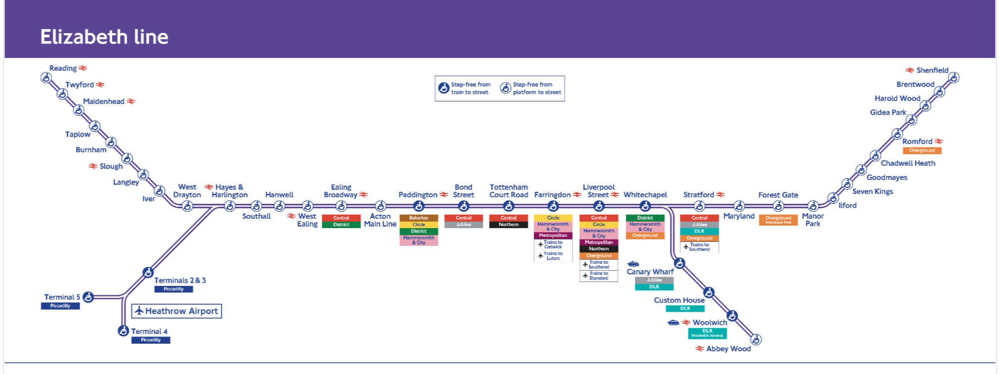

# purpleproject

## About
Find your perfect family home in the West of London along the new Elizabeth Line. Stations covered: Reading, Twyford, Maidnhead, Taplow, Burnham, Slough and Langley. The perfect home is defined below 

Elizabeth Line project - interactive map to help you decide on moving to a stop on the West of the Elizabeth line. 

## Technical Setup

Frontend - streamlit folium leaflet.js app using Python

# Data
### poi - points of interest csv file
Contains coordinates for Supermarkets, mcdonalds, Nandos, KFC, Dominos, Ikea , Airports, Libraries and Parks . **Operation** *This file is currently curated manually.*
  
| station    | poi       | Latitude | Longitude | Link |
|------------|-----------|----------|-----------|------|
| Maidenhead | mcdonalds |          |           |      |
| Slough     | Asda      |          |           |      |

### brand Logos processing- png images used as poi markers on the map
The images are sourced through a python process and stored under the  `brands` folder. The `brands.txt` file contains the list of poi brands. The process uses wiki website for logos. **Operation** *Brand logos can be run after determining the poi* 

### Distance and route to landmarks processing
We are interested in finding out how long it will take to drive to key landmarks like ikea, gatwick, heathrow. Being close to these landmarks is part of the perfect house score. The  geojson route is calculated through a subscription based api rapidapi.com **Operation** *Run this after scraping properties*
#### Setup
- ensure to set `ROUTE_DIRECTIONS_KEY` and `ROUTE_DIRECTIONS_HOST`  by getting the values from a new account at `route-and-directions.p.rapidapi.com`  

#### Inputs 
- `properties/EXTRACTION_DATE/<station>.json`
#### Outputs
- geojson files in the folder `process_distance/heathrow/<property_id>.json`
 
### Rightmove Property ingestion Process
Properties are sourced through a python process that will perform a scrape on Rightmove.co.uk. Property details are stored in a json file and stored under the folder  `properties/<YEAR>/<MONTH>/<DAY>/<STATION>.json` . Property searches are done for all West Elizabeth line stations, just added in the past 1 day and a raius of 2 miles.
**Operation** *Run this daily*
#### Inputs
- `PROPERTY_EXTRACT_DATE` - needed for the folder ingestion date name

# Development

### Virtual Enviornment setup
1. `pip install virtualenv`
2. `python3.11 -m venv .purple`

### Build and Run in a Docker container
1. `docker build -f ./Dockerfile -t lizproject:latest .`
2. `docker run -p 8501:8501 lizproject:latest`

# Run the app locally 
1. `streamlit run  ./main.py`
2. in a browser , goto http://localhost:8501

Jobs and Tasks
- [ ] curate points of interests over the West of London Stations
- [ ] Create the 
-   